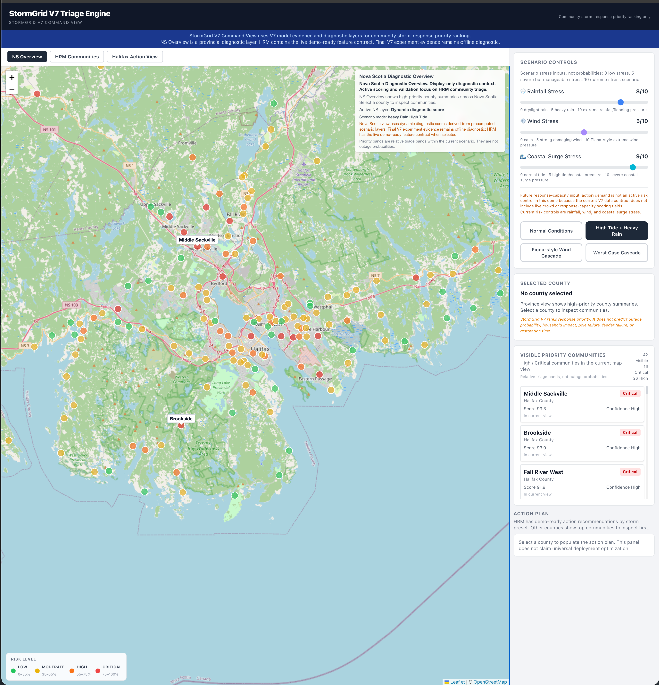

# StormGrid Lab

## Live Demo

[Open the live demo](https://storm-grid-lab-of-nova-scotia.vercel.app/)


StormGrid ranks HRM communities for storm response priority using a transparent weighted scoring model and sparse public data. Built for the Hack the Elements hackathon (May 2026, ShiftKey Labs).

## Demo Screenshot



## What It Does

StormGrid combines storm scenario inputs (wind, rain, surge) with community vulnerability proxies, historical outage context, and environmental exposure factors to produce an explainable response-priority score for each HRM community. The goal is a structured, auditable starting point for triage discussions — not a forecast or dispatch authority.

The demo covers:
- **HRM community ranking**: Ranked list under a selected storm scenario with score decomposition
- **Map view**: Color-coded priority bands over HRM communities
- **Community cards**: Score breakdown, confidence, and limitation notes
- **Action view**: Triage framing for high-priority communities
- **Nova Scotia overview**: Province-wide diagnostic context (not an active scoring path)

## Demo Flow

1. Open the Nova Scotia overview for broad visual context
2. Switch to HRM Communities to compare rankings under a storm scenario
3. Click a community card to inspect score drivers and limitations
4. Use the action view to review triage framing for high-priority communities

## Architecture Summary

| Layer | Files |
|---|---|
| Frontend | React, TypeScript, Vite (in `src/`) |
| Scoring engine | `src/engine/communityRiskEngine.ts` |
| Weight definitions | `src/engine/modelWeights.ts`, `public/data/model_weight_profiles.json` |
| Runtime data | Lightweight JSON files in `public/data/` |
| Validation scripts | Python scripts in `scripts/` |

All scoring logic runs in the browser. No server or API calls are needed.

## Model Summary

The active default profile weights five components:

| Component | Weight |
|---|---|
| Community hazard | 0.40 |
| Vulnerability | 0.25 |
| Historical prior | 0.20 |
| Wind/tree exposure | 0.10 |
| Rain/lowland exposure | 0.05 |

Six alternative weight profiles are available. Advanced model challengers (TabPFN, etc.) were explored offline and not promoted to the active demo — the transparent weighted model is better suited to explainable triage, and available replay labels do not support supervised learning.

## Data and Validation Limitations

- Community locations are centroid proxies, not official boundary polygons
- Vulnerability features include heuristic proxy values
- Storm parameters are hypothetical scenarios, not meteorological forecasts
- Validation is replay-based ranking evidence, not proof of future storm outcomes
- Replay labels are storm-invariant (same historical aggregate across all five storms)
- The evidence base is suitable for prototype validation, not operational deployment

## Data Policy

The public repository keeps only lightweight runtime data (~500 KB total in `public/data/`). Large GIS source caches, archived experiment outputs, and restricted diagnostic artifacts are excluded. See `docs/portfolio/DATA_MANIFEST.md` for details.

## How to Run Locally

```bash
npm install
npm run dev        # development server
npm run build      # production build
python scripts/numerical_parity_check.py   # verify formula parity
```

## Documentation

- [Project Case Study](./docs/portfolio/PROJECT_CASE_STUDY.md)
- [Model Card](./docs/portfolio/MODEL_CARD.md)
- [Validation Report](./docs/portfolio/VALIDATION_REPORT.md)
- [Data Manifest](./docs/portfolio/DATA_MANIFEST.md)

## Responsible Use

StormGrid is intended for exploratory storm-response planning and portfolio demonstration. It should be read as a community-priority ranking prototype, not as a utility forecast, deployment system, or probability model.

StormGrid is not:
- An outage prediction model
- A household, pole, or feeder-level prediction system
- A restoration-time estimator
- An official HRM or NS government deployment
- A production emergency system

All output should be reviewed by a domain-aware human before any operational use.